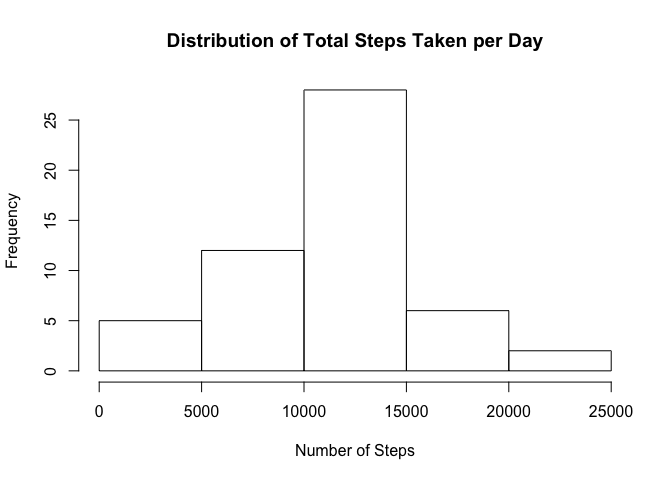
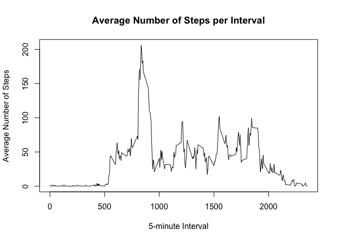
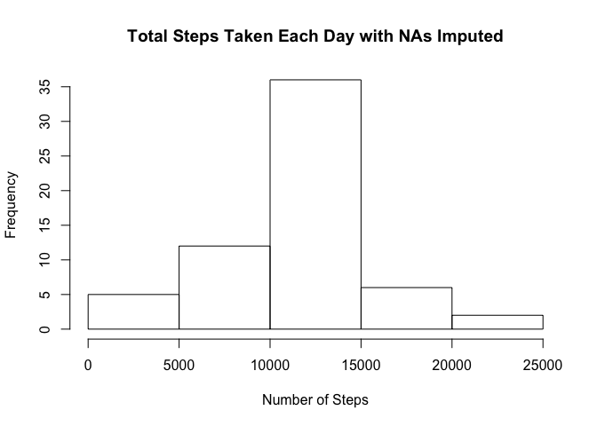
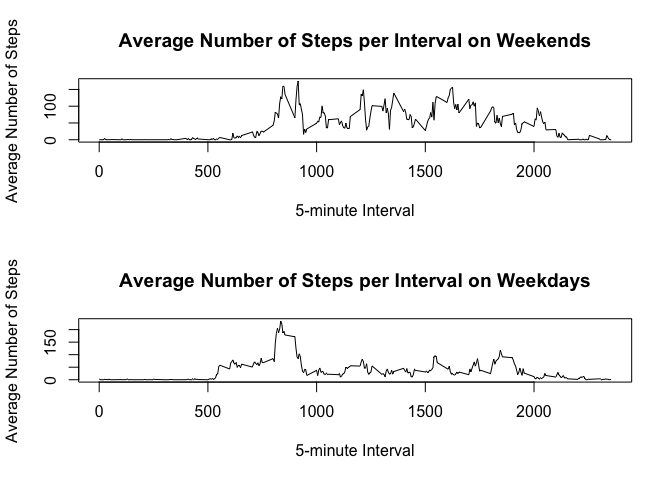

## Loading and preprocessing the data

1. Code for reading in and processing the dataset

```r
library(readr)
activity <- read_csv("activity.csv")
```

```
## Parsed with column specification:
## cols(
##   steps = col_integer(),
##   date = col_date(format = ""),
##   interval = col_integer()
## )
```

```r
View(activity)
activity$date <- as.Date(activity$date, format = "%Y-%m-%d")
```

## What is mean total number of steps taken per day?

2. Histogram of the total number of steps taken per day

```r
activity_na <- activity[with(activity, {!(is.na(steps))}),]
steps_by_day_na <- aggregate(activity_na["steps"], 
                             by = list(date = activity_na$date), 
                             sum)
steps_by_day_na
```

```
##          date steps
## 1  2012-10-02   126
## 2  2012-10-03 11352
## 3  2012-10-04 12116
## 4  2012-10-05 13294
## 5  2012-10-06 15420
## 6  2012-10-07 11015
## 7  2012-10-09 12811
## 8  2012-10-10  9900
## 9  2012-10-11 10304
## 10 2012-10-12 17382
## 11 2012-10-13 12426
## 12 2012-10-14 15098
## 13 2012-10-15 10139
## 14 2012-10-16 15084
## 15 2012-10-17 13452
## 16 2012-10-18 10056
## 17 2012-10-19 11829
## 18 2012-10-20 10395
## 19 2012-10-21  8821
## 20 2012-10-22 13460
## 21 2012-10-23  8918
## 22 2012-10-24  8355
## 23 2012-10-25  2492
## 24 2012-10-26  6778
## 25 2012-10-27 10119
## 26 2012-10-28 11458
## 27 2012-10-29  5018
## 28 2012-10-30  9819
## 29 2012-10-31 15414
## 30 2012-11-02 10600
## 31 2012-11-03 10571
## 32 2012-11-05 10439
## 33 2012-11-06  8334
## 34 2012-11-07 12883
## 35 2012-11-08  3219
## 36 2012-11-11 12608
## 37 2012-11-12 10765
## 38 2012-11-13  7336
## 39 2012-11-15    41
## 40 2012-11-16  5441
## 41 2012-11-17 14339
## 42 2012-11-18 15110
## 43 2012-11-19  8841
## 44 2012-11-20  4472
## 45 2012-11-21 12787
## 46 2012-11-22 20427
## 47 2012-11-23 21194
## 48 2012-11-24 14478
## 49 2012-11-25 11834
## 50 2012-11-26 11162
## 51 2012-11-27 13646
## 52 2012-11-28 10183
## 53 2012-11-29  7047
```


```r
hist(steps_by_day_na$steps, 
     main = "Distribution of Total Steps Taken per Day", 
     xlab = "Number of Steps")
```

<!-- -->

3. Mean and median number of steps taken each day

```r
mean_steps_na <- mean(steps_by_day_na$steps)
mean_steps_na
```

```
## [1] 10766.19
```

```r
median_steps_na <- median(steps_by_day_na$steps)
median_steps_na
```

```
## [1] 10765
```

## What is the average daily activity pattern?

4. Time series plot of the averages number of steps taken per 5-minute interval

```r
steps_by_interval_na <- aggregate(activity_na["steps"], 
                                  by = list(interval = activity_na$interval),
                                  mean)
plot(steps_by_interval_na$interval, 
     steps_by_interval_na$steps, 
     type = "l", 
     main = "Average Number of Steps per Interval", 
     xlab = "5-minute Interval", 
     ylab = "Average Number of Steps")
```

<!-- -->

5. The 5-minute interval that, on average, conains the maximum number of steps

```r
maximum_steps <- max(steps_by_interval_na$steps)
steps_by_interval_na[steps_by_interval_na$steps == maximum_steps, 1]
```

```
## [1] 835
```

## Imputing missing values

6. Code to describe and show a strategy for imputing missing data

```r
# Create dataset with only NA values intact 
activity_complete <- activity
```


```r
# Determine number of missing values 
missing_values_n <- nrow(activity_complete[is.na(activity_complete$steps), ])
```
The total number of missing values is 2304. 

To account for missing data, missing values are replaced with the mean number of steps for that interval. 

```r
# Create data set of mean number of steps for each day 
activity_complete_imp <- transform(activity_complete, 
                                   steps = ifelse(is.na(steps), ave(steps, interval, FUN = function(x) mean(x, na.rm = TRUE)), steps))

# Calculate total steps per day 
steps_by_day_complete <- aggregate(activity_complete_imp["steps"], 
                             by = list(date = activity_complete$date), 
                             sum)
```

7. Histogram of the total number of steps taken each day after missing values are imputed 

```r
hist(steps_by_day_complete$steps, 
     main = "Total Steps Taken Each Day with NAs Imputed", 
     xlab = "Number of Steps")
```

<!-- -->

```r
steps_by_day_complete[, c("date", "steps")]
```

```
##          date    steps
## 1  2012-10-01 10766.19
## 2  2012-10-02   126.00
## 3  2012-10-03 11352.00
## 4  2012-10-04 12116.00
## 5  2012-10-05 13294.00
## 6  2012-10-06 15420.00
## 7  2012-10-07 11015.00
## 8  2012-10-08 10766.19
## 9  2012-10-09 12811.00
## 10 2012-10-10  9900.00
## 11 2012-10-11 10304.00
## 12 2012-10-12 17382.00
## 13 2012-10-13 12426.00
## 14 2012-10-14 15098.00
## 15 2012-10-15 10139.00
## 16 2012-10-16 15084.00
## 17 2012-10-17 13452.00
## 18 2012-10-18 10056.00
## 19 2012-10-19 11829.00
## 20 2012-10-20 10395.00
## 21 2012-10-21  8821.00
## 22 2012-10-22 13460.00
## 23 2012-10-23  8918.00
## 24 2012-10-24  8355.00
## 25 2012-10-25  2492.00
## 26 2012-10-26  6778.00
## 27 2012-10-27 10119.00
## 28 2012-10-28 11458.00
## 29 2012-10-29  5018.00
## 30 2012-10-30  9819.00
## 31 2012-10-31 15414.00
## 32 2012-11-01 10766.19
## 33 2012-11-02 10600.00
## 34 2012-11-03 10571.00
## 35 2012-11-04 10766.19
## 36 2012-11-05 10439.00
## 37 2012-11-06  8334.00
## 38 2012-11-07 12883.00
## 39 2012-11-08  3219.00
## 40 2012-11-09 10766.19
## 41 2012-11-10 10766.19
## 42 2012-11-11 12608.00
## 43 2012-11-12 10765.00
## 44 2012-11-13  7336.00
## 45 2012-11-14 10766.19
## 46 2012-11-15    41.00
## 47 2012-11-16  5441.00
## 48 2012-11-17 14339.00
## 49 2012-11-18 15110.00
## 50 2012-11-19  8841.00
## 51 2012-11-20  4472.00
## 52 2012-11-21 12787.00
## 53 2012-11-22 20427.00
## 54 2012-11-23 21194.00
## 55 2012-11-24 14478.00
## 56 2012-11-25 11834.00
## 57 2012-11-26 11162.00
## 58 2012-11-27 13646.00
## 59 2012-11-28 10183.00
## 60 2012-11-29  7047.00
## 61 2012-11-30 10766.19
```


```r
mean_steps_complete <- mean(steps_by_day_complete$steps)
median_steps_complete <- median(steps_by_day_complete$steps)
```
The mean and median of the total number of steps taken per day with NA values filled in (intention to treat) is 1.0766189\times 10^{4} and 1.0766189\times 10^{4} respectively. Prior to replacing missing data with mean values, the mean and median were 1.0766189\times 10^{4} and 10765 respectively. Thus, there is not much difference in means, but the frequency around the mean is increased. 

## Are there differences in activity patterns between weekdays and weekends?

8. Panel plot comparing the average number of steps taken per 5-minute interval across weekdays and weekends 


```r
activity_weekends <- activity_na[weekdays(as.Date(activity_na$date)) %in% c("Saturday", "Sunday"), ]
activity_weekdays <- activity_na[weekdays(as.Date(activity_na$date)) %in% c("Monday", "Tuesday", "Wednesday", "Thursday", "Friday"), ]

steps_by_interval_weekends <- aggregate(activity_weekends["steps"], 
                                  by = list(interval = activity_weekends$interval),
                                  mean)
steps_by_interval_weekdays <- aggregate(activity_weekdays["steps"], 
                                  by = list(interval = activity_weekdays$interval),
                                  mean)

par(mfrow = c(2, 1))
plot(steps_by_interval_weekends$interval, 
     steps_by_interval_weekends$steps, 
     type = "l", 
     main = "Average Number of Steps per Interval on Weekends", 
     xlab = "5-minute Interval", 
     ylab = "Average Number of Steps")
plot(steps_by_interval_weekdays$interval, 
     steps_by_interval_weekdays$steps, 
     type = "l", 
     main = "Average Number of Steps per Interval on Weekdays", 
     xlab = "5-minute Interval", 
     ylab = "Average Number of Steps")
```

<!-- -->
